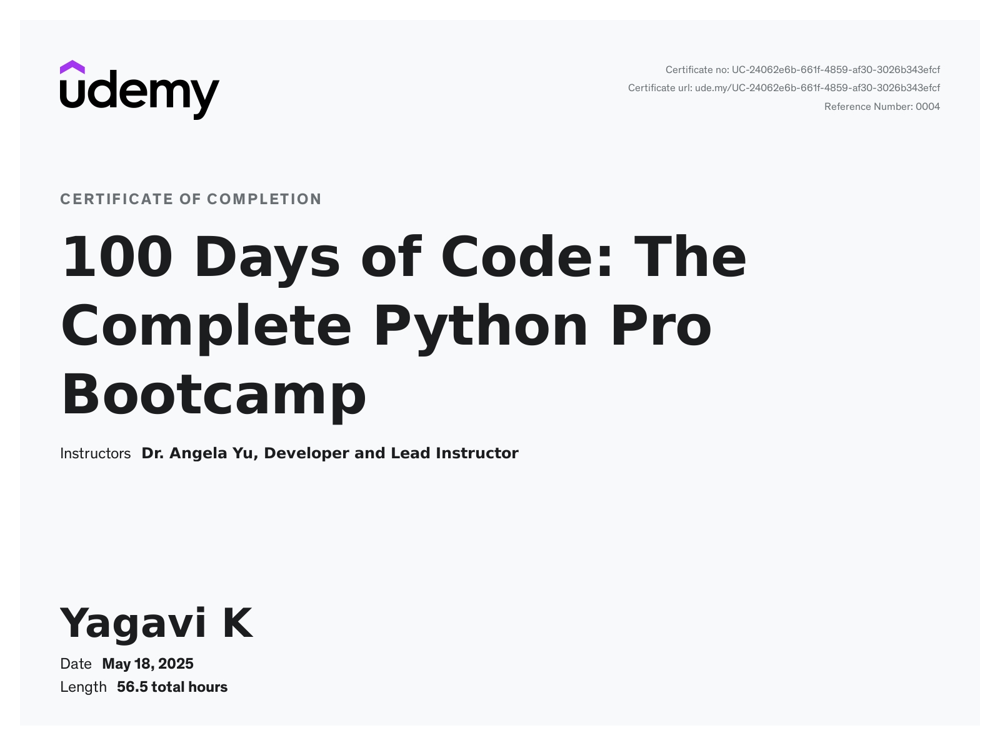

# 🐍 100 Days of Python Bootcamp – My Complete Journey

Welcome to my Python development journey through the 100 Days of Code: The Complete Python Pro Bootcamp for 2023 by Dr. Angela Yu. This repository is a chronological archive of my hands-on work, projects, and learnings — from beginner to intermediate Python developer.

> 🔥 100 Days of Code is not just a course — it’s a mindset shift.
> This is achieved by 100+ days of consistent coding, learning, building, and growing as a developer.

---

## 📜 Course Details

* 🎓 Platform: [Udemy](https://www.udemy.com/course/100-days-of-code/)
* 👩‍🏫 **Instructor: Dr. Angela Yu**
* 🛠 Focus: Real-world Python applications and full-stack development foundations
- 🖥 52 hours on-demand video 
- 💻 **23 coding exercises**  
- 📝 Assignments  
- 📄 **230 articles**  
- 📥 **163 downloadable resources**  
- 📱 **Access on mobile and TV**  
- 🏆 **Certificate of completion**
  
---

## 🔍 Repository Overview

This repo contains:

| Folder/File         | Description                                      |
| ------------------- | ------------------------------------------------ |
| `day01` to `day100` | Daily coding challenges, exercises, and projects |
| `certificate/`      | Contains the course completion certificate       |

> 🔄 Most folders contain a python files , along with related assets (images, data, etc.).

---

## 🧠 Topics Covered

🐍 **Core Python**  
  - Python 3 fundamentals  
  - Control flow & conditional statements  
  - Functions & recursion  
  - Object-Oriented Programming (OOP)  
  - Debugging & error handling  

🌐 **Python Ecosystem**  
  - PyCharm, Jupyter Notebook, Google Colab  
  - Automation scripts  
  - CSV & JSON parsing  
  - List, dict & set comprehensions  

📊 **Data Science**  
  - Pandas, NumPy  
  - Data visualization with Matplotlib, Plotly, Seaborn  
  - Scikit-learn basics  
  - Google Trends analysis  
  - Lego dataset exploration  

💻 **Web Development**  
  - HTML5, CSS3, Bootstrap 4  
  - Flask web applications  
  - REST APIs & authentication  
  - PostgreSQL & SQLite integration  
  - Deployment with Heroku & Gunicorn  

🤖 **Automation & Web Scraping**  
  - BeautifulSoup for HTML parsing  
  - Selenium WebDriver for browser automation  
  - HTTP requests handling  
  - Automation bots (Tinder, LinkedIn, Email, SMS)  

🎮 **Game Development**  
  - Turtle graphics  
  - Snake game, Pong, Blackjack  

🖥 **GUI Applications**  
  - Tkinter desktop apps  
  - Flashcard apps  
  - Password managers  

---

## 🛠 Notable Projects

| Day(s) | Project Name             | Description                                      |
| ------ | ------------------------ | ------------------------------------------------ |
| 14     | Coffee Machine Simulator | Command-line coffee vending simulation           |
| 21     | Snake Game               | Classic snake game with keyboard controls        |
| 31     | Flash Card App           | GUI-based app to memorize French words           |
| 47     | Birthday Wisher          | Sends automated birthday emails using SMTP       |
| 60     | Flight Deal Tracker      | Tracks cheap flights via Sheety and Tequila APIs |
| 63–66  | Habit Tracker            | Uses Pixela API to visualize personal habits     |
| 69–71  | RESTful Blog Website     | A full-stack blog with Flask and SQLAlchemy      |
| 81–83  | Advanced Authentication  | Login & registration system using Flask Login    |
| 100    | Capstone Project         | A polished final web app (customized personally) |

---

## 🏆 Certificate of Completion

I’ve successfully completed all 100 days and earned the official course certificate.

  

